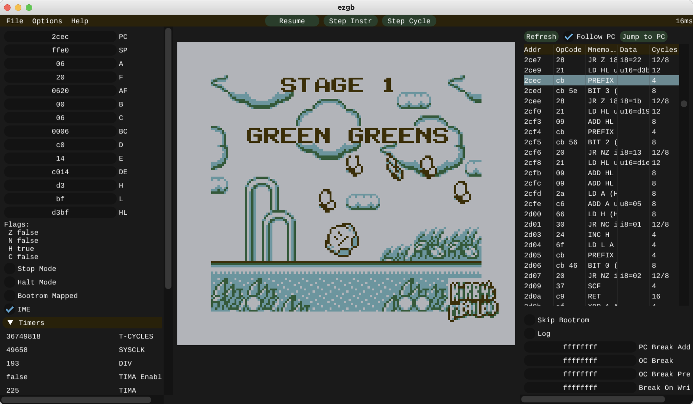
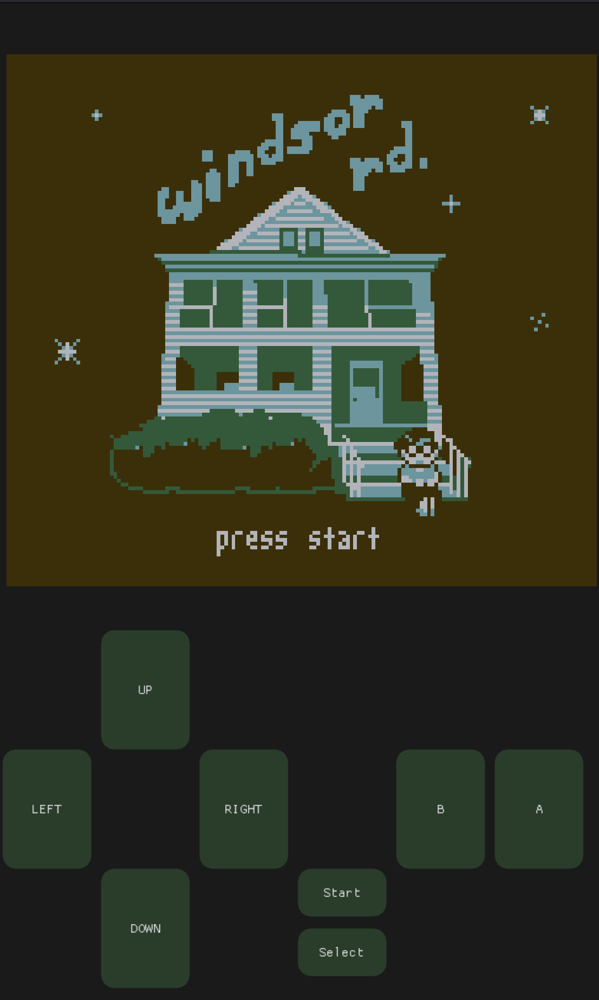

# ezgb

 
This is a Gameboy emulator written from scratch in C++20. It's not super accurate but it is mostly feature complete. It runs on all major desktop platforms as well as in the browser via WebAssembly 

[Click here to try me in your browser!](https://zillinger.ca/ezgb_wasm)

#### Features

* Plays most simple commercial games - ROM Only and MBC1 cartridge types
* Runs in the browser via WebAssembly
* Audio
* Debugger/Disassembler with breakpoints
* PPU Vram Debug Display

#### Things that can be improved

 * Support for more cartridge types, save files
 * Interrupt timing accuracy - games that rely heavily on this often stutter
 * V-Sync with host sytem without adding an extra frame of latency
 * More robust audio system - if the emulator doesn't run full speed you'll get crackling audio
 * T-Cycle PPU accuracy
 * APU accuracy - currently the oscillators are only updated on trigger
 * Performance - the PPU is especially wasteful. A simple tile cache could save a lot of CPU cycles
 * Mobile WebAssembly:
    * multi-touch support
    * proper browser detection - currently browser aspect ratio is used
    * mobile friendly menus
    * audio is crackly unless you have a very high end phone

### 3rd Party Dependencies

I tried to use as few 3rd party libraries as possible The only 3rd party libraries are:
* SDL2
* OpenGL
* ImGui (included)

### Building

* Requires CMake, a C++20 compiler, and SDL2
* Tested on GCC, LLVM Clang, MSVC, and Emscripten
* On Linux/MacOS install SDL2 with your package manager
* You'll need to install GCC or LLVM Clang on MacOS - AppleClang doesn't have enough C++20 support
* On Windows download an SDL2 release and set the path in the top level CmakeLists.txt

### Controls

* Z - A
* X - B
* A - Start
* S - Select
* Arrow Keys - D-Pad

* Space - Pause Emulation
* N, when paused - Step forward one clock cycle
* M, when paused - Step forward one instruction

### Mobile Browser Version

* If your browser has a tall enough aspect ratio ezgb will switch to a mobile layout

